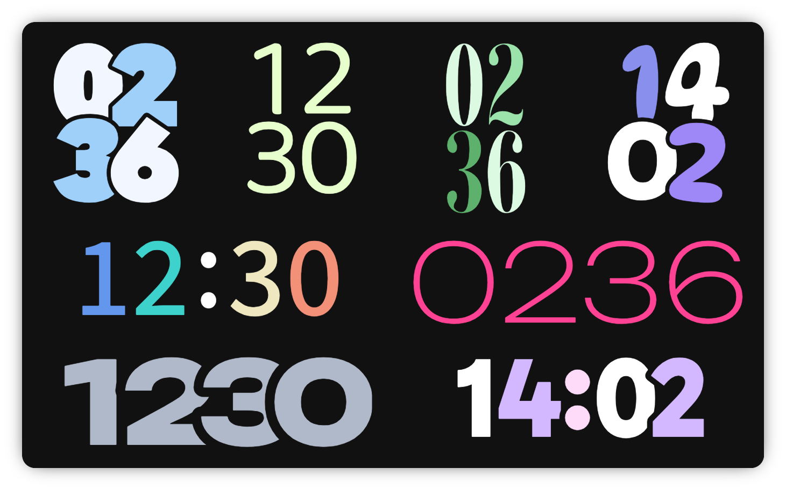

<div align="center">

# Custom Clock Card

**A highly customizable Home Assistant clock card**

</div>



Inspired by Google Pixel's lock screen clocks. I wanted something more playful than the usual flat digital clock for my dashboards, so I built this instead. Layout, colors, fonts, spacing, and background are all configurable, from the visual editor or plain YAML.

## Installation

### HACS

[](https://my.home-assistant.io/redirect/hacs_repository/?category=plugin&repository=custom-clock-card&owner=jancernik)

This adds it as a custom repository. If the button doesn't work, add it manually:

1. HACS → menu → Custom repositories
2. Repository: `https://github.com/jancernik/custom-clock-card`, type: Dashboard
3. Install **Custom Clock Card**

### Manual

1. Download `custom-clock-card.js` from the [latest release](https://github.com/jancernik/custom-clock-card/releases) or the `dist/` folder in this repository
2. Copy it to `config/www/custom-clock-card.js`
3. Add it as a Lovelace resource:

   ```yaml
   resources:
     - url: /local/custom-clock-card.js
       type: module
   ```

## Configuration

| Name                 | Type    | Default     | Description                                                                                   |
| -------------------- | ------- | ----------- | --------------------------------------------------------------------------------------------- |
| `layout`             | string  | `'line'`    | `'line'` (single row) or `'stacked'` (2x2 grid)                                               |
| `no_background`      | boolean | `false`     | Hide the card background, border, and shadow                                                  |
| `time_zone`          | string  | `''`        | IANA time zone, blank uses Home Assistant's zone                                              |
| `time_format`        | string  | `''`        | `'language'`, `'system'`, `'12'`, `'24'`, or blank to follow the viewer's own profile setting |
| `individual_colors`  | boolean | `false`     | Color each digit individually using `colors`, instead of one `color` for all                  |
| `color`              | string  | `'#fff'`    | Color for all digits when `individual_colors` is off                                          |
| `colors`             | list    | 4x `'#fff'` | Per-digit colors, used when `individual_colors` is on                                         |
| `natural_width`      | boolean | `true`      | Real character widths, or fixed-width cells for overlap control                               |
| `show_separator`     | boolean | `true`      | Show the separator (line layout only)                                                         |
| `separator`          | string  | `':'`       | Separator character(s)                                                                        |
| `separator_color`    | string  | `'#fff'`    | Separator color                                                                               |
| `separator_spacing`  | number  | `0`         | Extra spacing around the separator, in px                                                     |
| `separator_offset`   | number  | `0`         | Vertical nudge, in px, to fix off-center fonts                                                |
| `font_family`        | string  | `''`        | Empty uses the system font                                                                    |
| `font_url`           | string  | `''`        | Font file or stylesheet URL, see [Custom fonts](#custom-fonts)                                |
| `font_weight`        | number  | `400`       | Font weight                                                                                   |
| `gap`                | number  | `0`         | Transparent gap between digits, in px                                                         |
| `horizontal_spacing` | number  | `0`         | Space between digits, in px; negative overlaps (`natural_width: false` only)                  |
| `vertical_spacing`   | number  | `0`         | Space between rows, in px (stacked layout only)                                               |
| `padding`            | number  | `0`         | Space between the card edge and the clock, in px                                              |
| `scale`              | number  | `1`         | Overall scale                                                                                 |

### Custom fonts

`font_url` accepts either a font file (`.woff2`/`.ttf`/`.otf`/`.woff`, registered at runtime) or a stylesheet URL such as Google Fonts. In that case, `font_family` must match the family name the stylesheet provides:

```yaml
font_family: Google Sans Flex
font_url: https://fonts.googleapis.com/css2?family=Google+Sans+Flex:opsz,wght@6..144,1..1000&display=swap
```

To self-host, place the file in `config/www/fonts/` and point `font_url` to `/local/fonts/<file>`.
